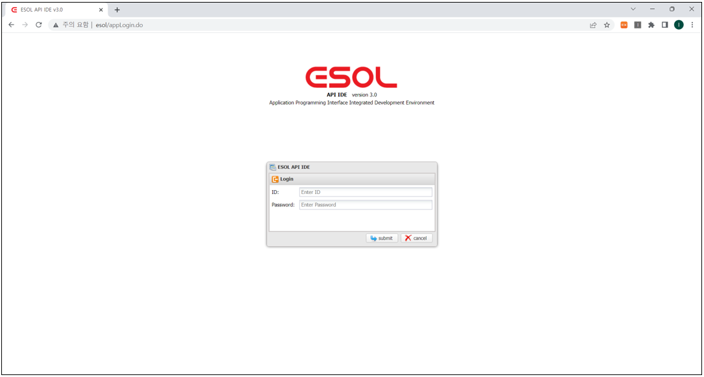
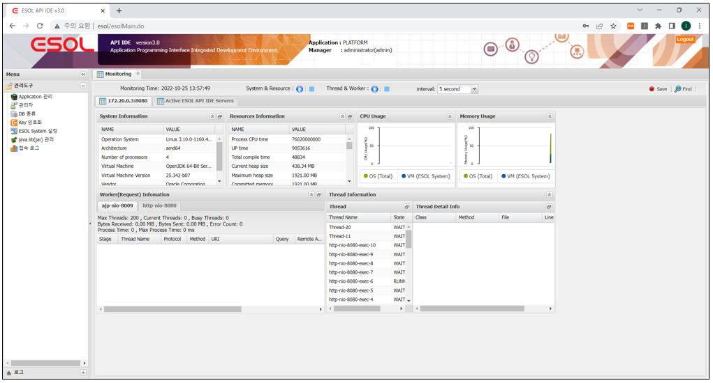

# ESOL SYSTEM v3.0 usage

---

  

  

## 목차

* [관리도구](./management-tools) 
	* [Application관리](./management-tools/01-management-application.md)
	* [관리자](./management-tools/01.management-manager.md)
	* [DB종류](./management-tools/01.management-dbservice.md)
	* [Key 암호화](./management-tools/01.management-keyencoding.md)
	* [ESOL System 설정](./management-tools/01.management-esolsystem.md)
	* [java lib(jar) 관리](./management-tools/01.management-javalib.md)
	* 접속 로그
* [로그](./log-tools/02.log-tools.md)
	* 로그 보기
	* 로그 통계 보기
	* 로그 실행수 Top
	* 로그 실행시간 Top
	* 로그 실시간 사용량
	* Proxy 로그 보기
 
