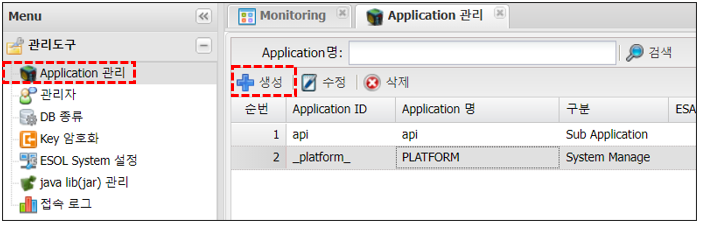
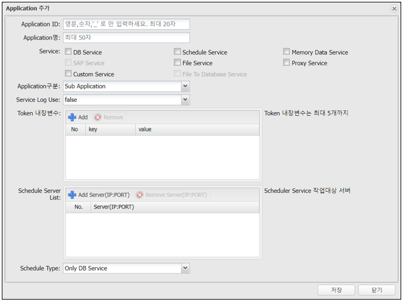

# Application 관리

---

## 1. Application 란
### 1.1. 정의

>ESOL은 Application 단위로 서비스 구현  
>ESOL에서 아래 와 같이 Application을 등록하여 사용 

>API (Application Programming Interface)  
>TMS (물류관리시스템)

📍 __주의) 구분 : "System Manager"생성, 수정, 삭제 불가__

## 2. 사용법
### 2.1. Application 생성
	
🎈 __Menu > 관리도구 > Application관리 > 생성__

 </img>

### 2.2. 속성

 </img>  

| 입력값 | 설명 |
|:--:|:--|
| Application ID | Application ID   Application을 상징하는 약자 권장 예) api, tms 등   /svc/db/tms/ORDER_LIST Service URL 사용 |
| Application 명 | Application의 이름 |
| Service (Check box) | Application이 사용할 수 있는 Service 선택 |
| Application 구분 | Main, Sub 중 선택, Main은 1개만 생성 가능 예) Main : /svc/db/ORDER_LIST Application ID 가 없는 Service URL Sub : /svc/db/tms/ORDER_LIST Application ID가 있는 Service URL |
| Service Log Use | Service Log 사용 유뮤, 단. 사용시 최대 3개월분만 저장 |
| Token 내장변수 | 인증완료시 추가 정보를 세션변수로 사용 예) key : "APPID" , value : "TTS" |
| Schedule Server List | Schedule Service의 실행 대상 서버 등록 |
| Schedule Type | Schedule Service의 대상 선택 Only DB Service(권장), DB Service and Java class|