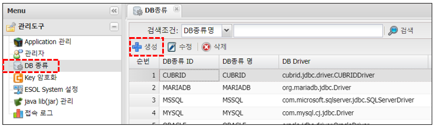
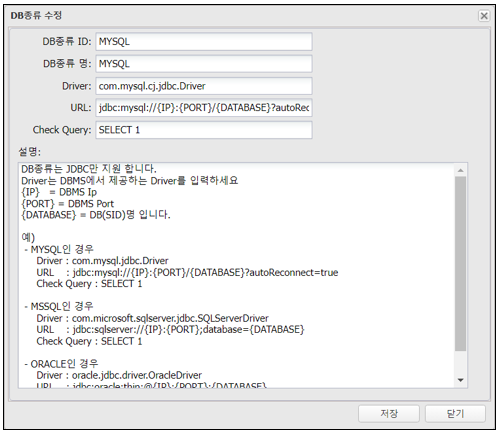

# DB 종류

---

## 1. DB 종류
### 1.1. 정의

>Application에서 사용 할 수 있는 Database(JDBC)를 관리하는 기능,  
>default : mysql, mariadb, cubrid, mssql, oracle, tibero, postgresql, presto, sqlite 제공  

>새로운 Database를 추가 할 경우 jdbc driver (jar)를 ESOL이 인식 할 수 있는  
>WAS의 lib 영역이나 Web App의 lib 영역에 반드시 있어야 한다. 

## 2. 사용법
### 2.1. DB 종류 생성

🎈 __Menu > 관리도구 > DB 종류 > 생성__

 </img>

### 2.2. 속성

 </img>

| 입력값 | 설명 |
|:--:|:--|
| DB종류 ID | DB종류 ID, 일반적으로 Vendor명으로 입력 |
| DB종류 명 | DB종류 명 |
| Driver | jdbc driver를 입력 |
| URL | JDBC URL |
| Check Query | Check Query |