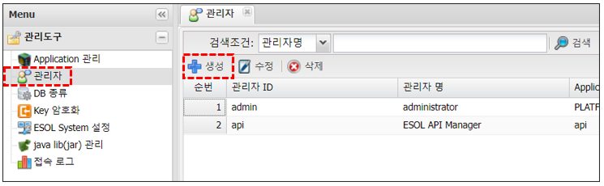
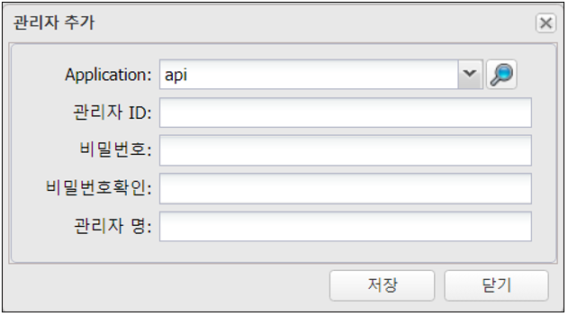

# 관리자

---

## 1. 관리자
### 1.1. 정의

>ESOL 서비스 생성 관리자 생성  
>Application 구분이 System Manager는 ESOL System 관리자 

## 2. 사용법 
### 2.1. 관리자 생성

🎈 __Munu > 관리도구 > 관리자 > 생성__

 </img>

### 2.2. 속성  

 </img>  

| 입력값 | 설명 |
|:--:|:--|
| Application | Application 선택 주의 : PLATFROM(System Manager)는 ESOL System 관리자 |
| 관리자 ID | 관리자 ID, 최대 25자리 영문, 숫자, _ |
| 비밀번호 | 비밀번호, 문자, 숫자, 특수문자의 조합으로 8~20자리 |
| 비밀번호 확인 | 비밀번호 확인 |
| 관리자 명 | 관리자명, 최대 50자 |
